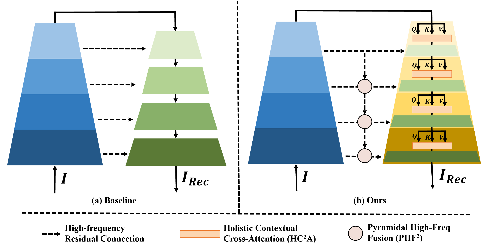
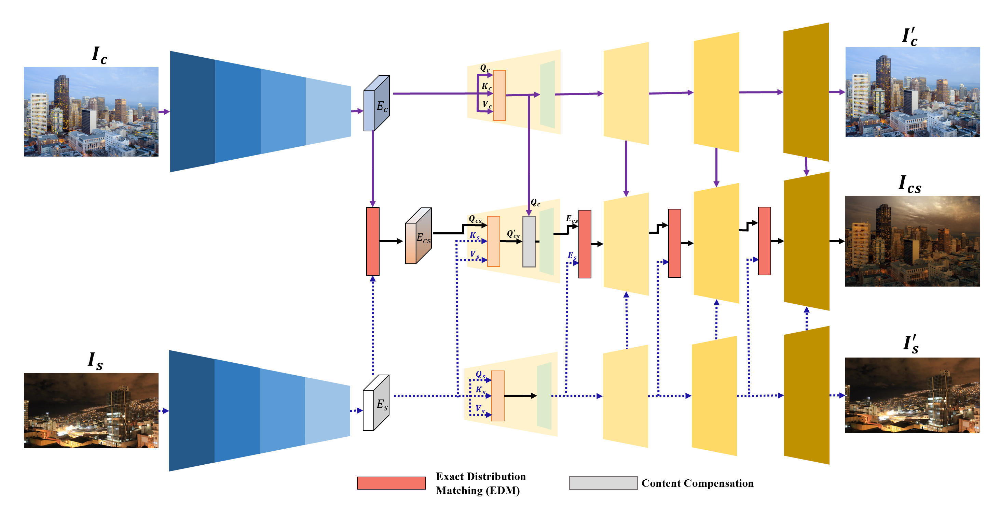
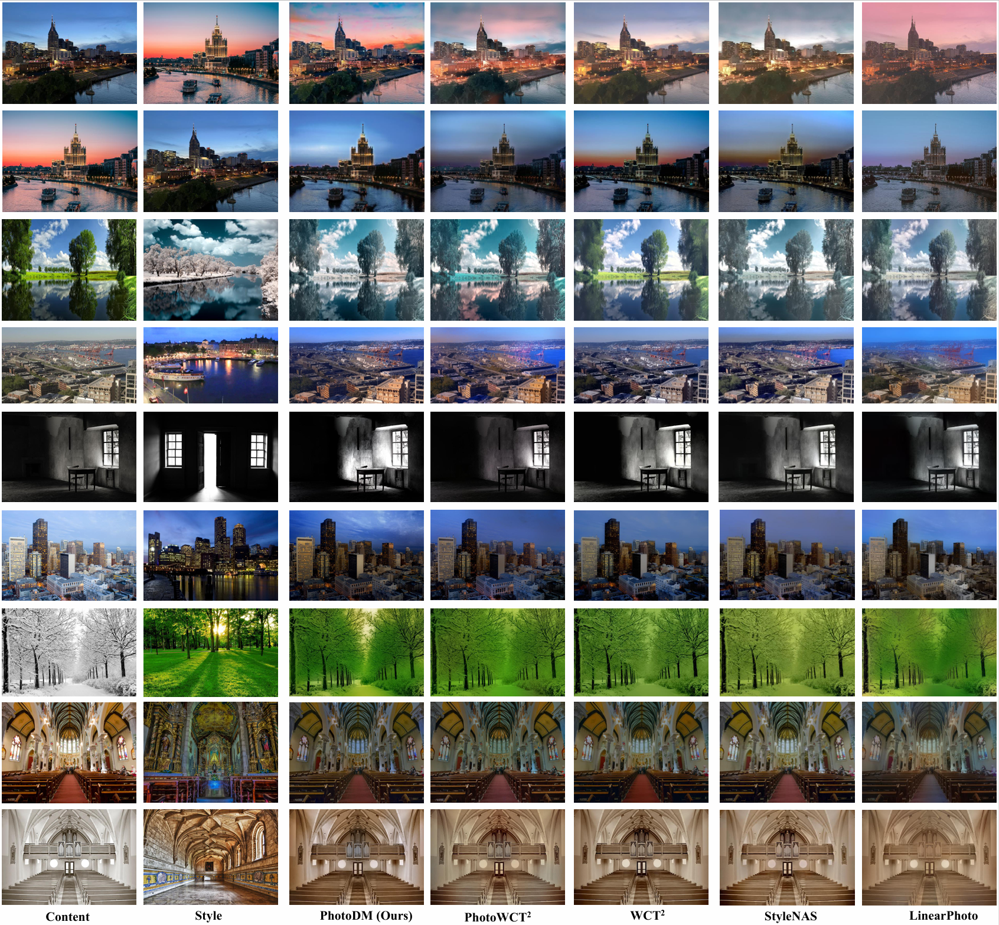
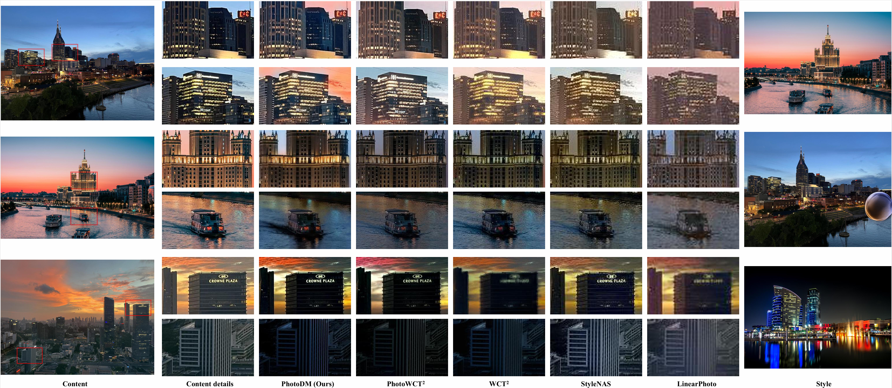

# PhotoDM: High-Fidelity Photorealistic Style Transfer via Pyramidal High-Frequency Autoencoder and Exact Distribution Matching

Pytorch implementation of our project ***PhotoDM: High-Fidelity Photorealistic Style Transfer via Pyramidal High-Frequency Autoencoder and Exact Distribution Matching***

## :newspaper: $\mathrm{I}$ - Introduction

Image style transfer (ST) aims to apply a reference style to a content image while preserving  content structure. However, photorealistic style transfer (PST) remains challenging. Existing methods (*e.g.*, WCT) often struggle to balance stylization quality and content fidelity, especially in structured real-world scenes, where even slight distortions can severely degrade visual realism. To address this issue, we propose a high-fidelity PST method that improves both content  detail preservation and style alignment. Specifically, we design a autoencoder with Pyramidal High-Freq Fusion (PHF<sup>2</sup>) and Holistic Contextual Cross-Attention (HC<sup>2</sup>A) to enhance detail recovery and content preservation. For more accurate stylization, Exact Distribution Matching (EDM) is introduced as an alternative to WCT transformation to achieve more precise feature alignment and better preserve content structural consistency. Moreover, a style KV injection scheme is employed to enhance style-aware feature modulation. Finally, a content compensation module is employed to reduce structural distortions during feature transformation. Experimental results show that our PhotoDM outperforms SOTA methods in both stylization quality and content fidelity, producing more realistic results with better content structural consistency.



*An overview of our Pyramidal High-Frequency Autoencoder.*



*Inference stage of photorealistic style transfer*

The visual results are shown as following:

*Visual comparison 1*



*Visual comparison for image details*

## :wrench: $\mathrm{II}$ - Dependencies

- python == 3.9.23
- xformers == 0.0.19
- torch == 2.0.0
- torchvision == 0.15.0
- tensorboardX == 2.6.4

## :bank: $\mathrm{III}$ - AutoEncoder Training

### :running: $\mathrm{III}$.1 - Dataset Preparation

For AutoEncoder training, we use [ImageNet](https://image-net.org/download.php) dataset. And the dataset folder structure should be like:

```
ImageNet
├── class1
│   ├── xxxx.jpg
│   ├── xxxx.jpg
│   ├── xxxx.jpg
│   ├── ...
├── class2
│   ├── xxxx.jpg
│   ├── xxxx.jpg
│   ├── xxxx.jpg
│   ├── ...
├── ...
├── classN
|   ├── xxxx.jpg
│   ├── xxxx.jpg
│   ├── xxxx.jpg
│   ├── ...
```

Then you can use `./DATA/generate_list.py` to generate list of training samples. Here we do not use `torchvision.datasets.ImageFolder` because it is very slow when dataset is pretty large. You can run

```
python ./DATA/generate_list.py --name {name your dataset such as PST} --path {path to your dataset}
```

A command sample is: 

- *python ./DATA/generate_list.py --name PST --path ./ImageNet*

Then the dataset file information is in ***./list_IMAGENET/PST_list.txt***.

### :running: $\mathrm{III}$.2 - Training

Get into training folder  `./TRAIN/ `:

```
cd ./TRAIN/
```

All the training settings are provided in function "get_args()" of the file "train_autoencoder.py". You can adapt them manually.

#### ResNet-archi AutoEncoder

A model architecture settings of ResNet-archi AE are as following:<a id="ResNetarchisetting"></a>

```
## model architecture
parser.add_argument('--arch', default='resnet34', type=str, choices=['vgg11', 'vgg13', 'vgg16', 'vgg19', 'resnet18', 'resnet34', 'resnet101', 'resnet152'],
                        help='backbone architechture')
### model architecture -> universal setting
parser.add_argument('--high_freq_residual', type=str, default="True")  # use high frequency residual?
parser.add_argument('--pyramid', type=str, default="True")  # use pyramidial high frequency fusion?
parser.add_argument('--skips_num', type=int, default=4, choices=[3, 4])  # number of reisuduals
parser.add_argument('--decoder_attn_version', type=str, default="v1",choices=['v1', 'v2', 'no'])  # attention version
parser.add_argument('--attn_residual', type=str, default="True")  # if residual in attention block
parser.add_argument('--use_conv', type=str, default="True")  # if convolution in attention block
parser.add_argument('--use_selfattn', type=str, default="True")  # if self-attention in attention block
### model architecture -> vgg
parser.add_argument('--encoder_version', type=str, default="v1", choices=['v1', 'v2'])  # encoder from torchvision (v2) or else (v1)? v2: only vgg16/19; v1: vgg11/13/16/19
### model pool setting -> activated when: encoder_version="v2"
parser.add_argument('--pool_method', type=str, default="average", choices=['average', 'max'])
### model architecture -> resnet
parser.add_argument('--resnet_norm', type=str, default="gn", choices=['gn', 'bn'])
```

Afterwards, you can train a ResNet-archi AE. Run:

```
python train_autoencoder.py --train_list ../list_IMAGENET/PST_list.txt --parallel 0
```

Notably, if you have more than **1 GPU**, you can specify hyper-parameter **"parallel" to 1**. 

After training, the checkpoints are in the folder **"./TRAIN/checkpoints/"**.

#### VGG-archi AutoEncoder

A model architecture settings of ResNet-archi AE are as following:<a id="VGGarchisetting"></a>

```
### model architecture
parser.add_argument('--arch', default='vgg19', type=str, choices=['vgg11','vgg13','vgg16','vgg19','resnet18','resnet34','resnet101','resnet152'],
                    help='backbone architechture')
### model architecture -> universal
parser.add_argument('--high_freq_residual', type=str, default="True")  # use high frequency residual?
parser.add_argument('--pyramid', type=str, default="True")  # use pyramidial high frequency fusion?
parser.add_argument('--pyramid_version', type=str, default="v2")  # use pyramidial high frequency fusion?
parser.add_argument('--skips_num', type=int, default=4, choices=[3,4]) # number of reisuduals
parser.add_argument('--decoder_attn_version', type=str, default="v2",choices=['v1','v2','no'])  # attention version
parser.add_argument('--attn_residual', type=str, default="True")  # if residual in attention block
parser.add_argument('--use_conv', type=str, default="True")  # if convolution in attention block
parser.add_argument('--use_selfattn', type=str, default="True")  # if self-attention in attention block
### model architecture -> vgg
parser.add_argument('--encoder_version', type=str, default="v1",choices=['v1','v2'])  # encoder from torchvision (v2) or else (v1)? v2: only vgg16/19; v1: vgg11/13/16/19
### model architecture -> activated when: encoder_version="v2"
parser.add_argument('--pool_method', type=str, default="max",choices=['average','max'])
### model architecture -> resnet
parser.add_argument('--resnet_norm', type=str, default="bn",choices=['gn','bn'])
```

Afterwards, you can train a ResNet-archi AE. Run:

```
python train_autoencoder.py --train_list ../list_IMAGENET/PST_list.txt --parallel 0
```

Notably, if you have more than **1 GPU**, you can specify hyper-parameter **"parallel" to 1**.

After training, the checkpoints are in the folder **"./TRAIN/checkpoints/"**.

## :lock: $\mathrm{IV}$ -  Model Testing

### :running: $\mathrm{IV}$.1 - Image reconstruction testing

Get into reconstruction testing folder  `./TEST/RECONSTRUCT/ `:

```
cd ./TEST/RECONSTRUCT/
```

First, you can generate validation dataset list using `./DATA/generate_list.py`. For example, The validation dataset list file is named as "PST_recon_list.txt"

#### ResNet-archi AutoEncoder

First, in file `./TEST/RECONSTRUCT/reconstruct.py`, set model configuration following [ResNet setting](#ResNetarchisetting). Then run the command:

```
python reconstruct.py --resume {path to ResNet-archi AE} --val_list {validation dataset list file}
```

A command sample is:

- *python reconstruct.py --resume ../../TRAIN/checkpoints/resnetAE.pth --val_list ../../list_IMAGENET/PST_recon_list.txt*

Then the reconstruction result is in `./TEST/RECONSTRUCT/`.

#### VGG-archi AutoEncoder

First, in file `./TEST/RECONSTRUCT/reconstruct.py`, set model configuration following [VGG setting](#VGGarchisetting). Then run the command:

```
python reconstruct.py --resume {path to VGG-archi AE} --val_list {validation dataset list file}
```

A command sample is:

- *python reconstruct.py --resume ../../TRAIN/checkpoints/VGGAE.pth --val_list ../../list_IMAGENET/PST_recon_list.txt*

Then the reconstruction result is in `./TEST/RECONSTRUCT/`.

### :running: $\mathrm{IV}$.2 - Photorealistic image style transfer

Get into style transfer testing folder  `./TEST/STYLE_TRANSFER/` :

```
cd ./TEST/STYLE_TRANSFER/
```

First, you can generate content and style dataset list using `./DATA/generate_list.py`. For example, The content and style dataset list files are named as "test_content_list.txt" and "test_style_list.txt".

#### Style Transfer based on ResNet-archi AutoEncoder

First, in file `./TEST/STYLE_TRANSFER/1_st_inference.py`, set model configuration following [ResNet setting](#ResNetarchisetting). Then run the command:

```
python 1_st_inference.py --resume {path to ResNet-archi AE} --style_condition {style injection methods} --kv_injection {if kv injection} --val_list_content {path to content dataset} --val_list_style {path to style dataset} --scale {rescale image}
```

A command sample is:

- *python 1_st_inference.py --resume ../../TRAIN/checkpoints/resnetAE.pth --style_condition efdm --kv_injection true --val_list_content ../../list_IMAGENET/test_content_list.txt --val_list_style ../../list_IMAGENET/test_style_list.txt --scale 0.5*

Note that, the hyper-parameter **"style_condition"** can be selected from ***"efdm/hm/id/adain/wct"***. The hyper-parameter **"kv_injection"** can be selected from ***"true/false"***.

Then the style transfer results are in `./TEST/STYLE_TRANSFER/figs_full_efdm`.

Finally, you can smooth stylized image by this command:

```
python 2_smoothen.py
```

You can specify image path manually like this:

```
stylised_folder = "./figs_full_efdm"
content_folder = "./content_efdm"
output_smooth_folder = "./output_smooth_efdm"
```

Then the smooth results are in `./TEST/STYLE_TRANSFER/output_smooth_efdm`.

#### Style Transfer based on VGG-archi AutoEncoder

First, in file `./TEST/STYLE_TRANSFER/1_st_inference.py`, set model configuration following [VGG setting](#VGGarchisetting). Then run the command:

```
python 1_st_inference.py --resume {path to VGG-archi AE} --style_condition {style injection methods} --kv_injection {if kv injection} --val_list_content {path to content dataset} --val_list_style {path to style dataset} --scale {rescale image}
```

A command sample is:

- *python 1_st_inference.py --resume ../../TRAIN/checkpoints/VGGAE.pth --style_condition efdm --kv_injection true --val_list_content ../../list_IMAGENET/test_content_list.txt --val_list_style ../../list_IMAGENET/test_style_list.txt --scale 0.5*

Note that, the hyper-parameter **"style_condition"** can be selected from ***"efdm/hm/id/adain/wct"***. The hyper-parameter **"kv_injection"** can be selected from ***"true/false"***.

Then the style transfer results are in `./TEST/STYLE_TRANSFER/figs_full_efdm`.

Finally, you can smooth stylized image by this command:

```
python 2_smoothen.py
```

You can specify image path manually like this:

```
stylised_folder = "./figs_full_efdm"
content_folder = "./content_efdm"
output_smooth_folder = "./output_smooth_efdm"
```

Then the smooth results are in `./TEST/STYLE_TRANSFER/output_smooth_efdm`.

## :white_check_mark: $\mathrm{V}$ - Model Checkpoint

| Backbone            | ResNet                                                                                             | VGG                                                                                 |
|:-------------------:|:--------------------------------------------------------------------------------------------------:|:-----------------------------------------------------------------------------------:|
| **checkpoint link** | [**ResNetAE**](https://drive.google.com/file/d/1rOs8NxiZAdzo3jVeCIafHYi3x5ObrcEH/view?usp=sharing) | [**VGGAE**](https://drive.google.com/file/d/1yKLmR8NedA2lYgnuchgxgSODO_A0F2eY/view) |

## :yum: $\mathrm{VI}$ - Acknowledgement

This repository is heavily built upon the amazing works [ImageNet-autoencoder](https://github.com/Horizon2333/imagenet-autoencoder) and [EFDM](https://github.com/YBZh/EFDM). Thanks for their great effort to community.

## :e-mail: $\mathrm{VII}$ - Contact

[Hongda Liu](mailto:2946428816@qq.com)
